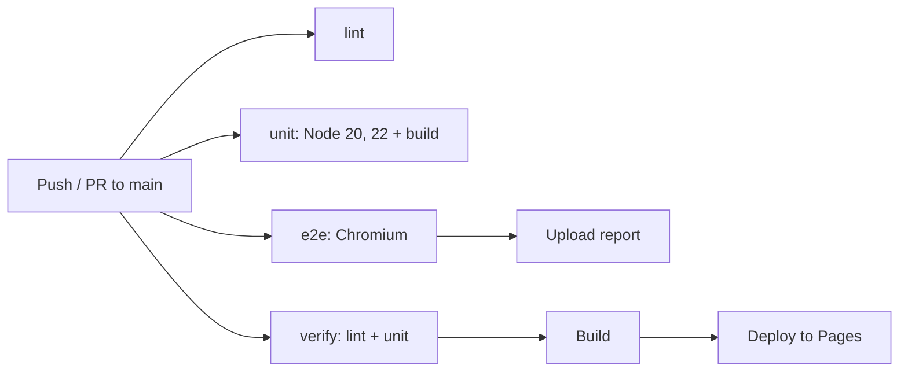

<div align="center">

# 🖼️ Glass Image Processor

#### Batch-resize, convert and zip images entirely in your browser — no upload, no server, no account.

[](https://github.com/ismailbimbashov/Image-Processor/actions/workflows/ci.yml)
[](https://github.com/ismailbimbashov/Image-Processor/actions/workflows/deploy.yml)


</div>

---

## Built With


---

## Overview

Glass Image Processor takes one or many images, runs them through a batch pipeline — resize, format conversion, or both — and hands back a single `converted-images.zip`. The work happens on a canvas inside your own browser, off the main thread in a Web Worker where the platform allows it. Nothing is uploaded, and the app installs as a PWA that keeps working with no network at all.

**Why you might want it.** Batch-converting a folder of screenshots usually means a desktop tool or an upload form you have to trust with your files. This does it locally from a page you can install and run offline. It is also unusually honest about formats: browsers silently return PNG bytes when asked for an encoder they lack, so the app probes what it can really write and removes the rest from the menu, then verifies output by magic bytes in its own test suite.

**Why you might not.** It can only encode what the browser can encode — in Chromium that rules out AVIF and GIF output. Sources are clamped to 4096px per edge and ~16.7M pixels before processing. SVG is rejected outright: this is a raster pipeline. There is no persistence, no history, and no queue — close the tab and the batch is gone. And it is a single-purpose tool, not a photo editor: no cropping, filters, or colour management.

---

## Features

- 🖱️ **Drag-and-drop or browse** — multi-select through a real drop handler ([`src/ui/dom.js`](src/ui/dom.js))
- 🚫 **Non-raster input rejected** — non-images and `image/svg+xml` never reach the pipeline ([`src/ui/dom.js`](src/ui/dom.js))
- 🧮 **Three modes** — Convert, Resize, or Resize + Convert in one pass ([`src/ui/tabs.js`](src/ui/tabs.js))
- 🔎 **Real encoder probing** — a 1×1 test encode per format; whatever the browser cannot write is removed from the menu ([`src/engine/capabilities.js`](src/engine/capabilities.js))
- 🏷️ **Substitution guard** — output is named for the bytes actually produced, never the format merely requested ([`src/engine/converter.js`](src/engine/converter.js))
- 🧵 **Off-thread pipeline** — an `OffscreenCanvas` Web Worker, with an automatic main-thread fallback ([`src/engine/worker.js`](src/engine/worker.js))
- 🧭 **EXIF orientation honoured** — decoding applies `imageOrientation` so rotated photos stay upright ([`src/engine/processor.js`](src/engine/processor.js))
- 🛡️ **Decompression-bomb guard** — shared canvas ceilings clamp both decode and resize targets ([`src/engine/limits.js`](src/engine/limits.js))
- 🔒 **Aspect-ratio lock** — fill one dimension and the other follows ([`src/engine/resizer.js`](src/engine/resizer.js))
- 🐢 **Sequential batch with partial tolerance** — a failed file is skipped and named; the rest still complete ([`src/engine/processor.js`](src/engine/processor.js))
- 📦 **Collision-safe ZIP entries** — same-named inputs get distinct entries, and names are sanitised against path traversal ([`src/utils/zipper.js`](src/utils/zipper.js))
- ↩️ **Two-click inline delete** — no blocking `window.confirm`, and controls lock while a batch runs ([`src/main.js`](src/main.js))
- ♿ **Keyboard-navigable** — the mode switch is a radio group with arrow, Home and End keys and a roving tabindex ([`src/ui/tabs.js`](src/ui/tabs.js))
- 📲 **Installable and offline** — service worker precaches the app shell ([`vite.config.js`](vite.config.js))
- 🔐 **Strict CSP** — `default-src 'none'`, no inline script or style, injected into the production build ([`vite.config.js`](vite.config.js))

---

## Quick Start

```bash
git clone https://github.com/ismailbimbashov/Image-Processor.git
cd Image-Processor
npm install
npm run dev
```

Vite prints a local URL — open it and drop in some images.

---

<details>
<summary><b>📦 Detailed Setup Guide</b></summary>

### a. Prerequisites

| Tool | Version | Why |
|---|---|---|
| Node.js | `^20.19.0 \|\| >=22.12.0` (from `engines`) | Vite 8 does not run on Node 18 |
| npm | ships with Node | Dependency install |
| Chromium | installed via Playwright | E2E suite only |

### b. Clone & install

```bash
git clone https://github.com/ismailbimbashov/Image-Processor.git
cd Image-Processor
npm install
npx playwright install chromium   # one-time, for the E2E suite
```

### c. Environment variables

The app reads no environment variables. These three are consumed by [`tests/playwright.config.js`](tests/playwright.config.js) only:

| Variable | Required | Description | Example |
|---|---|---|---|
| `PORT` | No | Port the Playwright-managed preview server binds to. Defaults to `8000`. | `5500` |
| `APP_URL` | No | Base URL to test against. Defaults to `http://localhost:${PORT}/`. | `http://localhost:5500/` |
| `CI` | No | Set by GitHub Actions; disables reuse of an already-running server. | `true` |

### d. Database setup

Not applicable — there is no backend and no persistence layer.

### e. Run the development server

```bash
npm run dev       # Vite dev server with HMR
npm run build     # production bundle into dist/
npm run preview   # serve the built bundle exactly as it deploys
```

The strict CSP is injected at **build** time only, so `npm run dev` intentionally runs without it (HMR needs inline script). Test against `build` + `preview`.

### f. Run the tests

```bash
npm run lint                       # ESLint across src, tests and configs
npm test                           # unit suite (Node's built-in runner)
npm run test:e2e                   # Playwright against the production build
npm run test:e2e:headed            # watch it in a real browser
npm run test:e2e:ui                # interactive UI mode
npx playwright show-report         # HTML report from the last run
```

Point the E2E suite elsewhere:

```bash
PORT=5500 npm run test:e2e
APP_URL=http://localhost:5500/ npm run test:e2e
```

</details>

---

<details>
<summary><b>📁 Project Structure</b></summary>

```
Image-Processor/
├── index.html                  # the single page: markup + Tailwind classes
├── vite.config.js              # build, PWA manifest/service worker, CSP injection
├── eslint.config.js            # flat config: browser, worker, Node and config envs
├── public/                     # passthrough assets (favicon, PWA icons)
├── src/
│   ├── main.js                 # composition root: state, Worker orchestration, SW registration
│   ├── styles.css              # Tailwind entry + custom animations
│   ├── ui/                     # the ONLY layer permitted to touch the DOM
│   │   ├── dom.js              #   event binding, upload, drag/drop, input filtering
│   │   ├── renderer.js         #   rendering, previews, form reads, delete arming
│   │   └── tabs.js             #   mode radio group (convert / resize / both)
│   ├── engine/                 # DOM-free pipeline — surfaces are injected
│   │   ├── worker.js           #   Web Worker entry, runs the pipeline off-thread
│   │   ├── processor.js        #   batch loop, decode (EXIF-aware), canvas clamping
│   │   ├── resizer.js          #   dimension maths + in-place canvas resize
│   │   ├── capabilities.js     #   startup probe: what can this browser really encode?
│   │   ├── converter.js        #   MIME mapping, canvas → Blob, substitution guard
│   │   └── limits.js           #   shared canvas ceilings (4096px edge, 16.7M px)
│   └── utils/
│       ├── zipper.js           #   ZIP assembly, filename sanitisation, entry dedup
│       ├── toast.js            #   non-blocking notifications
│       └── errorHandler.js     #   centralised user-facing messages
├── tests/
│   ├── unit/                   # 55 tests, Node's runner, no browser
│   ├── e2e/                    # 21 Playwright tests against the built app
│   └── playwright.config.js
└── .github/workflows/
    ├── ci.yml                  # lint + unit matrix (with build) + E2E
    └── deploy.yml              # verify, then publish dist/ to GitHub Pages
```

### The architectural rule

The engine never touches the DOM, and the UI never does canvas maths. Surfaces are injected rather than fetched from `document`, which is what lets the identical modules run on the main thread **and** inside the Worker — and be unit-tested in Node against mock canvases, with no browser and no mocking framework.

| Layer | Responsibility | Boundary |
|---|---|---|
| `engine/` | Resize maths, MIME mapping, encoding, probing, batch loop | No DOM reference anywhere; canvas and factories are arguments |
| `utils/` | ZIP assembly, filename safety, toasts, error copy | Pure helpers, directly unit-tested |
| `ui/` | All DOM reads and writes, previews, event delegation | The only layer that may call `document` |
| `main.js` | Owns state, orchestrates the Worker, wires the layers | Delegates all work downward |

</details>

---

## 🧪 Testing


Two layers, mirroring the architecture.

**Unit — `tests/unit/`.** 55 tests on Node's built-in runner, no browser. Because the engine is genuinely DOM-free these cover the real pipeline, not just leaf helpers: resize maths, `applyResize` driven through a mock `createCanvas` factory, canvas-limit clamping, MIME mapping, the encoder probe including the silent PNG-substitution case, and filename/path-traversal hardening.

**E2E — `tests/e2e/`.** 21 Playwright tests in Chromium, run against the **real production build** (`vite build` → `vite preview`), so the strict CSP, the bundled dependencies and the service worker are all exercised. The suite unzips each download and asserts **magic bytes** — a `.png` extension is not accepted as proof of PNG.

```bash
npm test                                   # unit
npm run test:e2e                           # full E2E suite
npm run test:e2e:ui                        # interactive UI mode
npx playwright test --config tests/playwright.config.js -g "signature"
npx playwright show-report
```

| Area | What is verified |
|---|---|
| Output integrity | PNG, JPG and WEBP entries carry real file signatures |
| Capability detection | Unencodable formats leave the menu; the selection always falls back to an encodable one |
| Modes | Convert, resize-only (format preserved), and resize + convert; actions reachable in all three |
| Robustness | Over-limit resize clamped not hung; partial batches zip only successes; same-named inputs stay distinct |
| Platform | Installable manifest, service worker offline, main-thread fallback without `OffscreenCanvas`, SVG rejected |
| Accessibility | Mode switch is a radio group with arrow keys; aspect lock is named and its knob tracks state |

> No coverage tool is configured, so there is no coverage badge.

---

## ⚙️ CI/CD

**[`ci.yml`](.github/workflows/ci.yml)** runs on every push and pull request to `main`:

- **`lint`** — ESLint across `src/`, `tests/` and the build configs.
- **`unit`** — the suite on Node 20 and 22, each followed by a production build, so a broken bundle cannot pass unnoticed. `fail-fast` is off so one version cannot hide the others.
- **`e2e`** — Chromium (cached by Playwright version), full suite against the built app; the HTML report uploads as an artifact even on failure.

**[`deploy.yml`](.github/workflows/deploy.yml)** runs on push to `main` and on manual dispatch: it lints and unit-tests, then builds and publishes `dist/` to GitHub Pages.



---

## 🚀 Deployment

`npm run build` emits a fully static `dist/` — hashed assets, a generated service worker, and the strict CSP inlined into the HTML. `vite.config.js` sets `base: "./"`, so the same build works from a domain root or a project sub-path without reconfiguration.

[`deploy.yml`](.github/workflows/deploy.yml) publishes it to GitHub Pages automatically. **It stays inert until Pages is enabled**: repository **Settings → Pages → Source: GitHub Actions**.

For any other static host (Netlify, Cloudflare Pages, S3), build and upload `dist/` as-is. There is no runtime, no server configuration, and no environment variables to set.

---

## Design Goals

- **The browser is the whole runtime.** No backend exists to trust, so privacy is structural rather than promised.
- **Testability as an architectural constraint.** The engine takes its surfaces as arguments, which is why the pipeline is unit-tested in Node and can be reused verbatim inside a Worker.
- **No silent lies.** Encoders are probed rather than assumed, files are named after their real bytes, clamping and substitutions are reported, and tests assert magic bytes rather than extensions.
- **Responsive under load.** Work moves off the main thread when `OffscreenCanvas` exists and degrades to a sequential main-thread loop when it does not.
- **Small surface, hardened edges.** One runtime dependency, a strict CSP, and explicit guards for oversized images, SVG input and colliding filenames.

---

## Comparable Tools

| Project | How this differs |
|---|---|
| [Squoosh](https://squoosh.app/) | Squoosh ships WASM codecs (MozJPEG, OxiPNG, AVIF) and focuses on one image at a time. This is batch-first and canvas-only: narrower encoding support, far smaller payload. |
| [TinyPNG](https://tinypng.com/) | TinyPNG uploads your images and compresses them server-side. This never sends a byte anywhere. |
| [ImageMagick](https://imagemagick.org/) / [sharp](https://sharp.pixelplumbing.com/) | Far more capable, but need a CLI or a Node backend. This is a page you can install and hand to a non-technical user. |

---

## 🤝 Contributing

Fork, branch from `main`, and open a pull request against `main`.

Keep the layer boundary intact: if logic can be written without touching the DOM it belongs in `src/engine/` or `src/utils/`, with a unit test beside it. E2E tests go in `tests/e2e/` and should assert file signatures rather than extensions.

Run all three checks before opening a PR — CI runs the same ones:

```bash
npm run lint && npm test && npm run test:e2e
```

Commit subjects in this repository follow a `v.<version>/<step>: <summary>` pattern (for example `v.2/1: Vite build + strict CSP + clean project structure`).

---

## 📄 License

MIT — see [LICENSE](LICENSE). Free to fork, modify and distribute.
